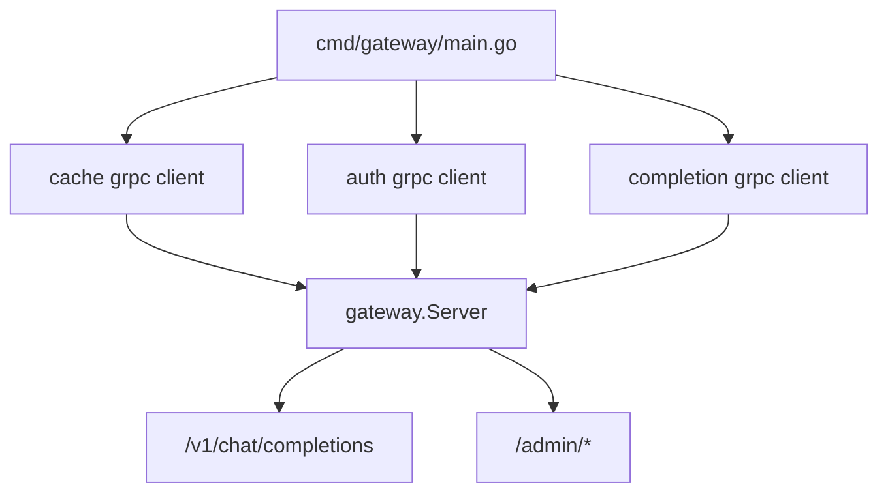
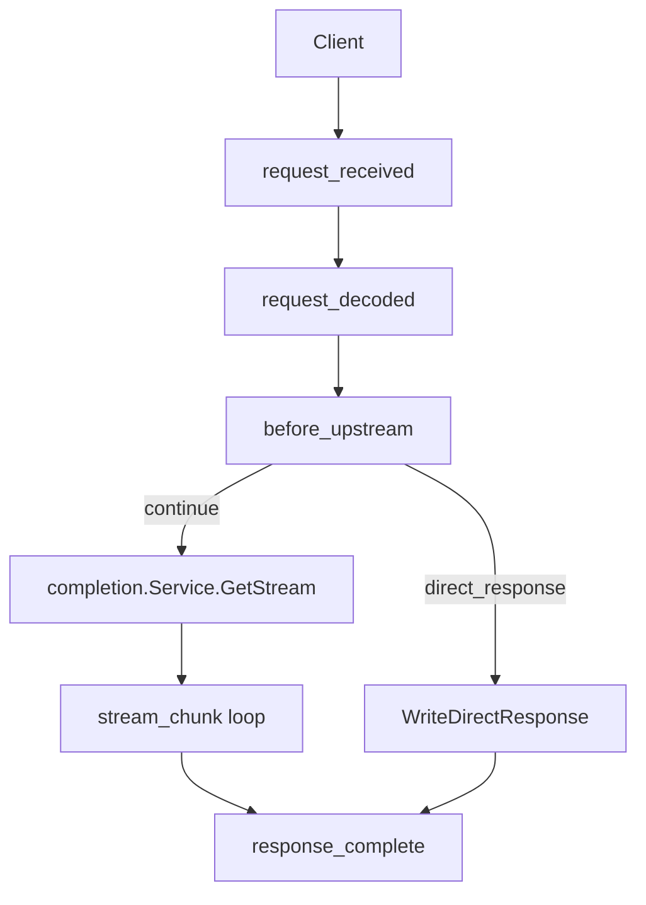

# Gateway 工作机制说明

`⚠️ This doc is written by LLM`

本文档说明当前 `gateway` 模块的职责边界、启动方式、请求主链路、阶段化处理模型、流式响应行为以及管理接口的工作机制。

当前代码结构中：

- `cmd/gateway/main.go` 只负责进程入口、依赖装配和 HTTP 服务启动
- `gateway/` 负责 HTTP 网关的全部核心逻辑
- `auth`、`cache`、`completion` 继续作为独立服务能力，通过接口注入到 `gateway` 中使用

## 1. 模块定位

`gateway` 是系统的 HTTP 数据面入口，负责接收客户端请求，并将请求编排到以下几个能力：

- `auth.Service`
  负责 API token 的创建、查询与删除
- `cache.Service`
  负责语义缓存查询和回填
- `completion.Service`
  负责向上游 LLM 发起流式补全请求

它本身不直接实现 Redis、Qdrant 或上游模型访问，而是通过依赖注入使用这些服务。

## 2. 启动与装配

启动入口位于 `cmd/gateway/main.go`。

启动流程如下：

1. 从环境变量读取 `CACHE_ADDR`、`COMPL_ADDR`、`AUTH_ADDR`、`DEBUG_MODE`
2. 分别创建 cache、completion、auth 的 gRPC client
3. 用这些依赖构造 `gateway.NewServer(...)`
4. 注册公网接口 `/v1/chat/completions`
5. 启动 admin 服务 `:8081`
6. 如开启 `DEBUG_MODE=true`，同时注册 pprof
7. 启动主 HTTP 服务 `:8080`

可以把启动关系理解为：

## 3. `gateway.Server` 的职责

`gateway.Server` 是网关内部的核心装配对象。

它封装了两类东西：

- `services`
  保存外部依赖，即 `auth`、`cache`、`completion`
- `pipeline`
  保存阶段化处理器集合

它负责提供两组对外入口：

- `RegisterPublicRoutes(mux)`
  注册用户请求入口 `/v1/chat/completions`
- `AdminHandler()`
  注册并保护 `/admin/create`、`/admin/get`、`/admin/delete`

也就是说，`gateway.Server` 是“HTTP 入口层”和“阶段执行器”的结合点。

## 4. 请求上下文 `GatewayContext`

每次进入 `CompletionHandler` 后，网关都会创建一个新的 `GatewayContext`。

这个对象用于在整个请求生命周期内保存共享状态，避免在不同函数和阶段之间来回传递大量参数。

它主要由下面几块组成：

- `Request`
  保存原始 HTTP 请求、解析后的 body、拼接后的 prompt 等
- `Auth`
  保存 bearer token、用户标识、鉴权结果
- `Route`
  保存目标服务、模型名和路由标签
- `Upstream`
  保存即将发往上游 completion 服务的请求，以及上游错误和完成状态
- `Stream`
  保存当前 chunk、chunk 序号、累计回答内容、token usage
- `Response`
  保存响应头、直接响应对象、是否已开始流式输出、是否来自缓存
- `Runtime`
  保存执行期状态，例如是否占用了并发信号量
- `Services`
  保存依赖注入进来的服务接口
- `Data`
  作为未来插件扩展的保留槽位

### 为什么需要这个对象

因为当前网关不再是“一个大函数从头写到尾”，而是一个显式阶段执行模型。  
阶段之间必须共享状态，而 `GatewayContext` 就是这个共享媒介。

## 5. 阶段化 Pipeline 模型

当前 `gateway` 使用显式阶段流水线处理 chat completions 请求。

### 5.1 阶段定义

当前共有 5 个阶段：

1. `request_received`
2. `request_decoded`
3. `before_upstream`
4. `stream_chunk`
5. `response_complete`

它们分别对应：

- `request_received`
  请求刚到达，尚未解析 body
- `request_decoded`
  body 已读取并解码为请求对象
- `before_upstream`
  已具备发往上游的前置条件，可以做鉴权、缓存、路由
- `stream_chunk`
  每收到一个上游 chunk 时执行
- `response_complete`
  请求结束后统一收尾

### 5.2 处理器接口

每个阶段可以挂多个 `StageHandler`。

处理器接口统一为：

- `Name()`
  返回处理器名称
- `Stages()`
  声明自己挂在哪些阶段
- `Handle(*GatewayContext) StageResult`
  读取/修改上下文，并返回控制结果

### 5.3 返回动作

阶段处理器通过 `StageResult.Action` 控制主链路：

- `continue`
  继续后续处理器或下一阶段
- `reject`
  拒绝请求，直接返回错误
- `direct_response`
  不再访问上游，直接返回一个完整响应
- `stop_pipeline`
  停止当前阶段的后续处理器，但不一定终止整个请求

### 5.4 当前注册的处理器

当前默认 pipeline 中挂载了以下处理器：

- `cors_handler`
- `rate_limit_handler`
- `token_extract_handler`
- `request_decode_handler`
- `prompt_build_handler`
- `auth_validate_handler`
- `mock_response_handler`
- `cache_lookup_handler`
- `upstream_request_build_handler`
- `stream_assemble_handler`
- `cache_writeback_handler`
- `audit_log_handler`

## 6. 公网请求主链路

客户端对 `/v1/chat/completions` 的请求，大致会经过如下链路：

下面按阶段展开。

## 7. `request_received` 阶段

这一阶段处理尚未读取 body 的基础请求逻辑。

### 7.1 `cors_handler`

职责：

- 设置 `Access-Control-Allow-Origin`
- 设置 `Access-Control-Allow-Methods`
- 设置 `Access-Control-Allow-Headers`
- 处理浏览器 `OPTIONS` 预检请求

如果请求方法为 `OPTIONS`，处理器会直接构造一个 `DirectResponse`，并返回 `direct_response`，此时主链路不会继续向下执行。

### 7.2 `rate_limit_handler`

职责：

- 使用令牌桶限制总体速率
- 使用并发信号量限制同时在途请求数

当前参数为：

- 生成速率 `100`
- 桶容量 `200`
- 最大并发 `50`

如果命中限流，会直接返回 `429` 错误，并终止请求。

### 7.3 `token_extract_handler`

职责：

- 读取 `Authorization` 头
- 检查是否符合 `Bearer <token>` 格式
- 使用本地格式校验快速拒绝非法 token

这里的本地校验不会访问 auth 服务，它只是提前检查 token 是否像一个合法的 `sk-*` token，以降低无效请求对后端服务的压力。

## 8. `request_decoded` 阶段

这一阶段开始读取 body，并将请求标准化。

### 8.1 `request_decode_handler`

职责：

- 读取 `r.Body`
- 保存原始 `BodyBytes`
- 反序列化为 `ChatCompleteionRequest`

如果 body 不合法，会直接返回 `400`。

### 8.2 `prompt_build_handler`

职责：

- 从 `messages` 中拼接出单一的 `PromptText`
- 填充 `NormalizedKey`
- 将请求中的 `model` 写入 `Route.Model`

这里的 `NormalizedKey` 目前等于拼接后的 prompt，后续如果需要引入更稳定的归一化策略，可以在这里扩展。

## 9. `before_upstream` 阶段

这是决定“是否真的要访问上游”的关键阶段。

### 9.1 `auth_validate_handler`

职责：

- 调用 `auth.Service.Get(token)`
- 检查 token 是否存在、是否被撤销
- 记录用户别名到 `Auth.Subject`

只有经过这一步，网关才认为请求真正通过鉴权。

### 9.2 `mock_response_handler`

职责：

- 检查请求头 `x-mock: true`
- 若命中，构造一个 mock 的 SSE 响应并直接返回

这个处理器主要用于测试或本地验证。

### 9.3 `cache_lookup_handler`

职责：

- 调用 `cache.Service.Get(ctx, prompt, model)`
- 判断语义缓存是否命中

如果命中：

- 标记 `Response.FromCache = true`
- 构造 `DirectResponseCachedStream`
- 不再访问上游 completion 服务

这意味着缓存命中时，网关会短路主链路。

### 9.4 `upstream_request_build_handler`

职责：

- 将请求转换成 `completion.CompletionRequest`
- 写入 `Upstream.Request`
- 将 `TargetService` 标记为 `completion`

只有这一步完成后，主流程才真正具备调用上游的条件。

## 10. 访问上游 completion 服务

如果 `before_upstream` 没有短路，`CompletionHandler` 会调用：

- `completion.Service.GetStream(ctx, req)`

这里返回的是一个 channel，channel 中的元素是 `completion.CompletionChunk`。

也就是说，`gateway` 自身不直接调用 OpenAI 兼容接口，而是通过 `completion` 服务间接访问上游模型。

## 11. `stream_chunk` 阶段与 SSE 转发

`streamUpstreamResponse()` 是公网请求流式转发的核心逻辑。

### 11.1 进入流模式前

网关会先：

- 设置 SSE 响应头
- 检查 `ResponseWriter` 是否支持 `http.Flusher`
- 标记 `Response.StreamStarted = true`
- 标记 `Upstream.Started = true`

### 11.2 chunk 循环

对于上游返回的每一个 chunk，网关都会：

1. 检查客户端是否已断开连接
2. 将 chunk 写入 `GatewayContext.Stream.CurrentChunk`
3. 递增 `ChunkIndex`
4. 执行 `stream_chunk` 阶段处理器
5. 若 chunk 有内容，则封装成 OpenAI 风格 SSE 数据块回给客户端
6. 若 chunk 标记 `Done`，则发送结束 chunk 和 `data: [DONE]`

### 11.3 `stream_assemble_handler`

当前 `stream_chunk` 阶段默认只挂了一个处理器：`stream_assemble_handler`

它的职责是：

- 记录流中错误
- 将每个 chunk 的文本累计到 `Stream.FullAnswer`
- 在最后一个 chunk 上记录 `TokenUsage`

因此它更像一个“流式状态累积器”，而不是一个 chunk 改写器。

## 12. 直接响应机制

当前网关支持三类直接响应：

- `body`
  普通 JSON/文本 body
- `cached_stream`
  缓存命中后模拟 SSE 流
- `mock_stream`
  mock 请求返回的模拟 SSE 流

它们统一走 `writeDirectResponse()` 输出，而不是由各个阶段处理器直接写 `ResponseWriter`。

这样做有两个好处：

- 控制流不会散落在各个处理器里
- 为未来插件化保留统一宿主出口

## 13. `response_complete` 阶段

这是统一收尾阶段，不论请求是正常走上游、缓存命中短路，还是中途报错，理论上都会走到这里。

### 13.1 `cache_writeback_handler`

职责：

- 仅在以下条件成立时回填缓存：
  - 本次响应不是缓存命中
  - 上游没有报错
  - `FullAnswer` 非空

- 调用 `cache.Service.Set(...)` 写回缓存

### 13.2 `audit_log_handler`

职责：

- 打印简化的用户输入和模型输出
- 在缓存命中时，也会打印缓存返回的回答内容

当前日志只在 `DEBUG` 级别下有效。

## 14. Admin API 工作机制

除了公网 `/v1/chat/completions`，网关还提供 admin 接口：

- `POST /admin/create`
- `POST /admin/get`
- `POST /admin/delete`

### 14.1 鉴权方式

admin 接口不走主 pipeline，而是由：

- `AdminHandler()`
- `RegisterAdminRoutes(...)`
- `adminCheckMiddleware(...)`

组合而成。

访问时必须带：

- `X-Admin-Secret: <ADMIN_SECRET>`

否则直接返回 `403 Forbidden`。

### 14.2 三个接口的职责

- `/admin/create`
  调用 `auth.Service.Create(alias)` 创建 token
- `/admin/get`
  调用 `auth.Service.Get(token)` 查询 token 状态
- `/admin/delete`
  调用 `auth.Service.Delete(token)` 删除 token

这些接口本质上是 auth 服务的 HTTP 管理入口。

## 15. 当前设计的特点

### 优点

- `cmd/gateway` 已经被收缩成薄入口
- `gateway/` 包结构与其它模块一致
- 请求主链路显式分阶段，便于理解和扩展
- 直接响应、缓存命中、上游流式透传都被统一到了宿主控制流里
- 为未来 Lua/WASM 插件化预留了稳定边界

### 当前约束

- `StreamChunk` 目前主要是观测和累积，不支持复杂 chunk 改写
- `Data map[string]any` 只是扩展槽，当前并未形成正式插件 ABI
- 管理接口和公网接口共用 `gateway.Server`，但 admin 还没有进入统一阶段模型

## 16. 后续可扩展方向

如果后续继续演进，这套结构最自然的方向包括：

- 为阶段处理器增加插件适配层，使 Go/Lua/WASM 共用 `StageHandler` 边界
- 将 `stream_chunk` 扩展为受控的 chunk 改写能力
- 将指标、trace、审计信息统一沉淀到 `GatewayContext.Data`
- 继续将 `gateway/` 内部按 `chat`、`admin`、`pipeline`、`transport` 再细分子目录

## 17. 总结

当前 `gateway` 的本质已经不再是“一个 handler 调几个服务”，而是一个：

- 以 `GatewayContext` 为共享状态中心
- 以 `Pipeline` 为控制流骨架
- 以阶段处理器为策略承载点
- 以 `completion` 流式通道为上游接口
- 以宿主统一输出 SSE/错误响应

的 HTTP 网关执行引擎。

这使得它既保持了当前实现的简单性，也为后续缓存策略、鉴权策略、插件化和多上游路由演进打下了比较清晰的结构基础。
